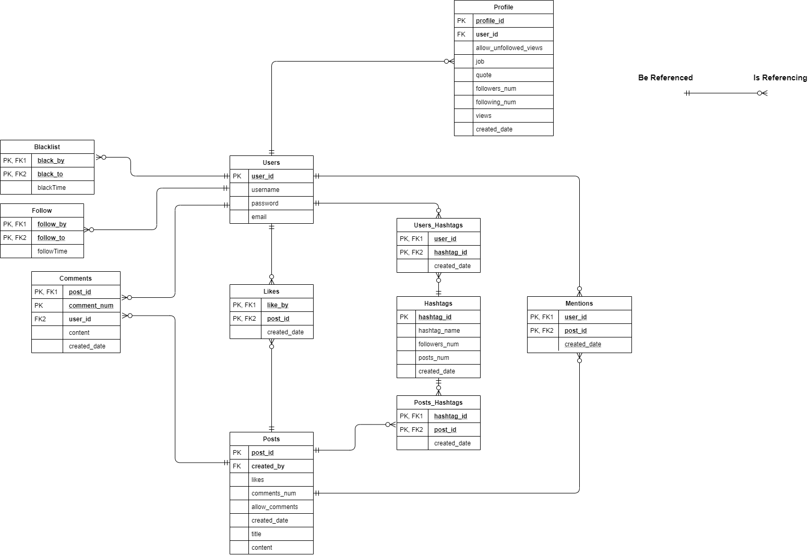

# Golang Social Network API

## Intro

This is a social network API programed in Go. 

* It has no frontend components yet, only backend part is available
* You NEED TO download postman or other softwares to check out the functionality

Below is the database design: 



## How to run ?

```
apt-get install -y go 
go get github.com/gin-gonic/gin
go get github.com/badoux/checkmail
go get golang.org/x/crypto/bcrypt
go get github.com/go-sql-driver/mysql
go get github.com/gorilla/sessions
go get github.com/urfave/negroni
```

## Something to say before

I used only `GET` and `POST` because `gin` in go cannot pass body in a delete request. 

## What it allows you to do

In order to navigate what is available for you, you need to first: 

1. `http://localhost:8882/user/signup`: `POST Request`, enter `username`, `password`, `password_repeated`, `email` to signup


2. `http://localhost:8882/user/login`: `POST Request`, enter `username`, `password` to let you login

3. `http://localhost:8882/user/logout`: `POST Request`, It lets you logout instantly

* The rest part requires you to login, since the code stores your session data, please do not log out !! I have populated the database for you, so you can enjoy :)

### Posts

4. `http://localhost:8882/api/create_post`: `POST Request`, enter `title`, `content` to upload posts. In the `content` section, 

If your content is `#Welcome# this is my first post. @user1 Thanks for inviting me`. 

`#Welcome#` please use two hashtags to make a hashtag topic.  

`@user1` use one `@` to indicate mentioning people.

* You can set this post to `allow_comments = true` to allow comments which is the default setting
* If `allow_comments = false` to disallow comments, then this post cannot be commented, and comments already made will not be shown

5. `http://localhost:8882/api/delete_post`: `POST Request`, enter `post_id`, it will delete the post that has `post_id` and created by YOU

6. `http://localhost:8882/api/update_post`: `POST Request`, enter `post_id`, `title`, `content` 

7. `http://localhost:8882/api/like_post`: `POST Request`, enter `post_id` in the post request. Then your `user_id` and the `post_id` will be stored in `Likes`, and the likes number of this post will also increment


8. `http://localhost:8882/api/unlike_post`: `POST Request`, enter `post_id` to dislike. 

9. `http://localhost:8882/api/create_comments`: `POST Request`, enter `post_id` and `content`. 


10. `http://localhost:8882/api/follow_user`: `POST Request`, enter `username`

11. `http://localhost:8882/api/unfollow_user`: `POST Request`, enter `username`

12. `http://localhost:8882/api/blacklist_user`: `POST Request`, enter `username` to blacklist this user. Then 

a. `this user will not be able to see your profile`
b. `this user will not be able to see any of your new posts through http://localhost:8882/api/explore where latest posts of your followings are shown`
c. `this user will not be able to see any of your new posts through http://localhost:8882/api/explore_hashtag_posts where latest posts of the hashtag are shown`

13. `http://localhost:8882/api/unblacklist_user`: `POST Request`, enter `username` to unblacklist this user

14. `http://localhost:8882/api/profile/2`: `GET Request`, this url displays the profile of user_id = 2. You can only see the profile if you are not blocked. If the owner set allow_unfollowed_views = false, then you have to be a follower of the owner to view profile

15. `http://localhost:8882/api/follow_hashtag`: `POST Request`, enter `hashtag_name` to follow this hashtag

16. `http://localhost:8882/api/unfollow_hashtag`: `POST Request`, enter `hashtag_name` to unfollow this hashtag

### Explore

The above part mainly focuses a specific attempt, for example, creating, deleting, updating or following. However, this `Explore` part focuses on viewing

17. `http://localhost:8882/api/explore`: `GET Request`, it displays the latest posts of people who you are following. You cannot see people's posts who blocked you

18. `http://localhost:8882/api/explore_hashtag_posts`: `POST Request`, enter `hashtag_name` to view the hottest posts of the hashtags you followed. You cannot see people's posts who blocked you. And if a post is set as private, you must be a follower you visit.  